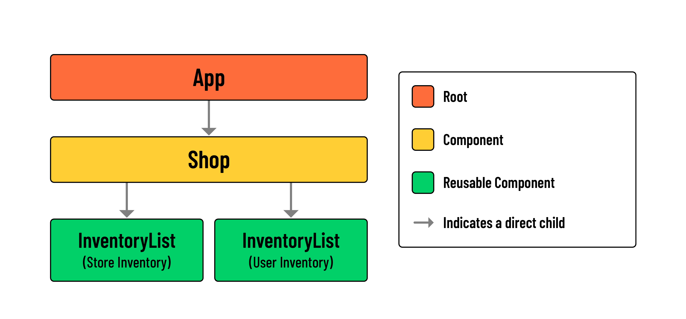
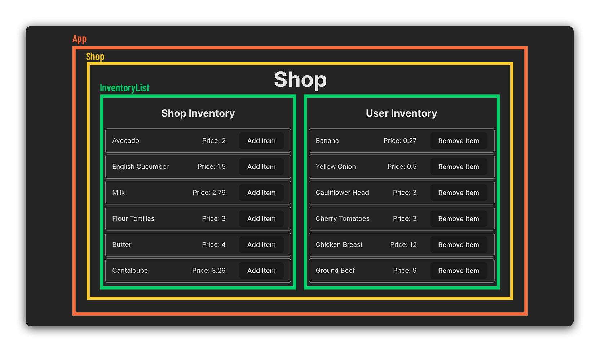

# Lifting State with Arrays in React Shopping Cart

## Component Hierarchy and Layout

### Learning objective: By the end of this lesson, students will be able to plan out a component hierarchy for a React App.

## Learning objective: By the end of this lesson, students will be able to plan out a component hierarchy for a React App.

In the following sections, we’ll get some practice with rendering arrays of objects and initializing state in React. We’ll also learn how to update arrays in state.

Our goal is to create a Shop component where users can select items they wish to add to their cart. Take a look at the screenshot below for a better idea of what we are building:

